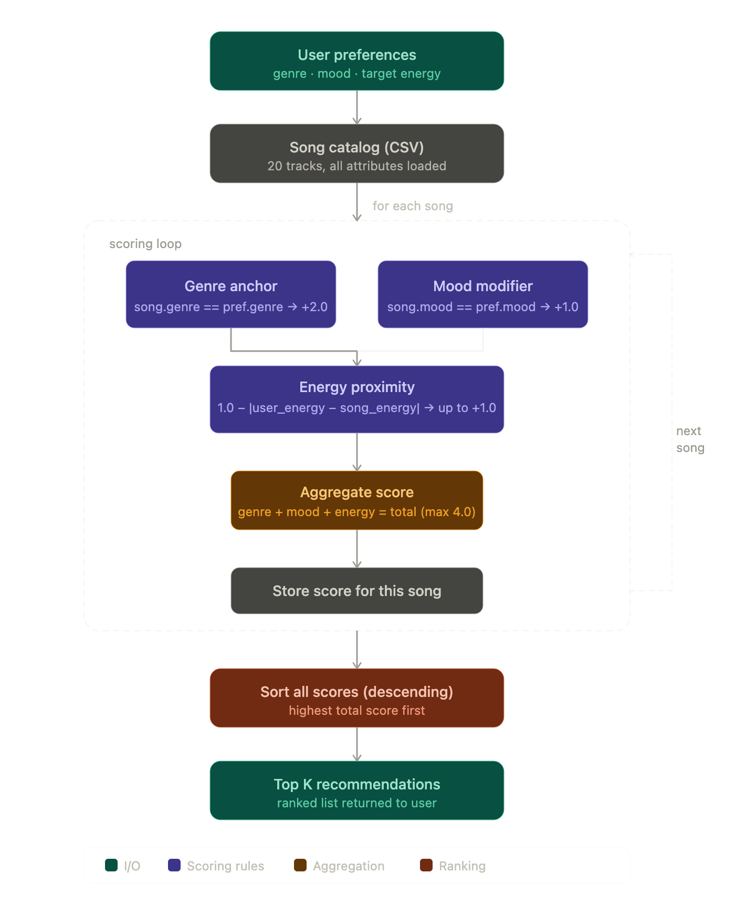

# 🎵 Music Recommender Simulation

## Project Summary

In this project you will build and explain a small music recommender system.

Your goal is to:

- Represent songs and a user "taste profile" as data
- Design a scoring rule that turns that data into recommendations
- Evaluate what your system gets right and wrong
- Reflect on how this mirrors real world AI recommenders

Replace this paragraph with your own summary of what your version does.

---

## How The System Works

Explain your design in plain language.

My version of the recommender system uses a weighted content-based filtering approach, where each song is treated as a set of attributes and compared against a user’s personalized “Vibe Profile.” Each song is described by its genre and mood, which are categorical features, as well as its energy level, which is a numerical value between 0.0 and 1.0. The user profile stores their ideal preferences for these same attributes, allowing the system to measure how well each song aligns with what they’re looking for. The scoring logic prioritizes genre as the strongest signal, awarding +2.0 points for a match, followed by mood with +1.0 point. Energy is handled differently, using a linear decay formula (1.0 − |UserEnergy − SongEnergy|) to reward songs that are closest to the user’s desired energy level rather than simply favoring high or low values. After calculating a total score for every song in the dataset, the system sorts all songs from highest to lowest score and returns the top K recommendations.

Song Features: title, genre, mood, energy (float).

UserProfile Features: fav_genre, fav_mood, target_energy (float).


My current plan:
My version of the recommender uses a Weighted Content-Based Filtering approach. It treats every song as a collection of data points and compares them against a user's specific "Vibe Profile."

Data Features
Song Features: title, genre, mood, energy (0.0–1.0).

UserProfile: favorite_genre, favorite_mood, target_energy.

System Architecture & Logic
The following flowchart visualizes how a single user profile is compared against the entire song catalog to produce a ranked list:




The Algorithm Recipe
Genre Anchor (+2.0): If the song genre matches the user's preference, it receives a heavy bonus. This ensures the recommendation stays within the user's preferred style.

Mood Modifier (+1.0): If the mood matches, a secondary bonus is applied to refine the "feeling" of the recommendation.

Energy Proximity (Up to +1.0): Calculated as 1.0 - abs(user_energy - song_energy). This rewards songs that are closer to the user's target intensity.

Final Ranking: All scores are summed (max 4.0), and the system sorts the songs to return the Top K results.

Potential Biases
Genre Over-Prioritization: Because Genre is worth twice as much as Mood, the system may ignore a perfectly "Sad" song if it belongs to a different genre, potentially creating a "Genre Filter Bubble."

Small Catalog Limitation: With only 20 songs, the system might struggle to find a "perfect" match, leading to recommendations that only meet one of the three criteria.
---

## Getting Started

### Setup

1. Create a virtual environment (optional but recommended):

   ```bash
   python -m venv .venv
   source .venv/bin/activate      # Mac or Linux
   .venv\Scripts\activate         # Windows

2. Install dependencies

```bash
pip install -r requirements.txt
```

3. Run the app:

```bash
python -m src.main
```

### Running Tests

Run the starter tests with:

```bash
pytest
```

You can add more tests in `tests/test_recommender.py`.

---

## Experiments You Tried

Use this section to document the experiments you ran. For example:

- What happened when you changed the weight on genre from 2.0 to 0.5
- What happened when you added tempo or valence to the score
- How did your system behave for different types of users

---

## Limitations and Risks

Summarize some limitations of your recommender.

Examples:

- It only works on a tiny catalog
- It does not understand lyrics or language
- It might over favor one genre or mood

You will go deeper on this in your model card.

---

## Reflection

Read and complete `model_card.md`:

[**Model Card**](model_card.md)

Write 1 to 2 paragraphs here about what you learned:

- about how recommenders turn data into predictions
- about where bias or unfairness could show up in systems like this


---

## 7. `model_card_template.md`

Combines reflection and model card framing from the Module 3 guidance. :contentReference[oaicite:2]{index=2}  

```markdown
# 🎧 Model Card - Music Recommender Simulation

## 1. Model Name

Give your recommender a name, for example:

> VibeFinder 1.0

---

## 2. Intended Use

- What is this system trying to do
- Who is it for

Example:

> This model suggests 3 to 5 songs from a small catalog based on a user's preferred genre, mood, and energy level. It is for classroom exploration only, not for real users.

---

## 3. How It Works (Short Explanation)

Describe your scoring logic in plain language.

- What features of each song does it consider
- What information about the user does it use
- How does it turn those into a number

Try to avoid code in this section, treat it like an explanation to a non programmer.

---

## 4. Data

Describe your dataset.

- How many songs are in `data/songs.csv`
- Did you add or remove any songs
- What kinds of genres or moods are represented
- Whose taste does this data mostly reflect

---

## 5. Strengths

Where does your recommender work well

You can think about:
- Situations where the top results "felt right"
- Particular user profiles it served well
- Simplicity or transparency benefits

---

## 6. Limitations and Bias

Where does your recommender struggle

Some prompts:
- Does it ignore some genres or moods
- Does it treat all users as if they have the same taste shape
- Is it biased toward high energy or one genre by default
- How could this be unfair if used in a real product

---

## 7. Evaluation

How did you check your system

Examples:
- You tried multiple user profiles and wrote down whether the results matched your expectations
- You compared your simulation to what a real app like Spotify or YouTube tends to recommend
- You wrote tests for your scoring logic

You do not need a numeric metric, but if you used one, explain what it measures.

---

## 8. Future Work

If you had more time, how would you improve this recommender

Examples:

- Add support for multiple users and "group vibe" recommendations
- Balance diversity of songs instead of always picking the closest match
- Use more features, like tempo ranges or lyric themes

---

## 9. Personal Reflection

A few sentences about what you learned:

- What surprised you about how your system behaved
- How did building this change how you think about real music recommenders
- Where do you think human judgment still matters, even if the model seems "smart"

